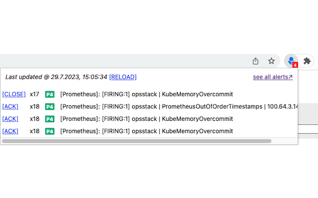

# Opsgenie Notifier

An extension for showing latest alerts and getting notifications for new alert(s) via polling Opsgenie’s REST API.

## Installation

**Get here:** 

### Manual Installation:

* Clone the repository
* Then open "**chrome://extensions**" on your browser, switch **Developer mode** mode on.
* Load the extension by clicking "**Load unpacked**"

---

## About

### Configuration:
* Select Opsgenie region: US or EU
* Set API Key from your Opsgenie account which have READ access. The ACK/Close Actions requires Write Access. Read [OpsGenie help](https://support.atlassian.com/opsgenie/docs/api-key-management/) for more information.
* Set Time Interval for polling Rest API, keep in mind your rates :)
* [Optional] Put down your Alert Query if needed (About: https://docs.opsgenie.com/docs/alerts-search-query-help)

### Extension Popup:
* Check your latest 10 alerts by clicking Opsgenie logo on browser's extensions section
* See count of alerts on icon's badge (max limit is 100)
* Check for error messages

### Notifications:
* If you have new notifications after new request to REST API, you will get browser notification.
* If there is one, you can access that notification via clicking it.
* If more than one, you can see list of them (not supported for MacOS because of OS limitations)

---

## License
[MIT](https://choosealicense.com/licenses/mit/)
